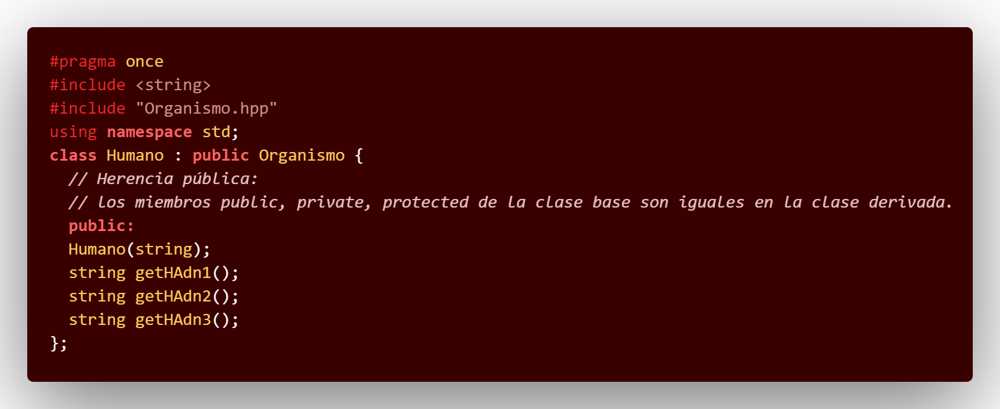
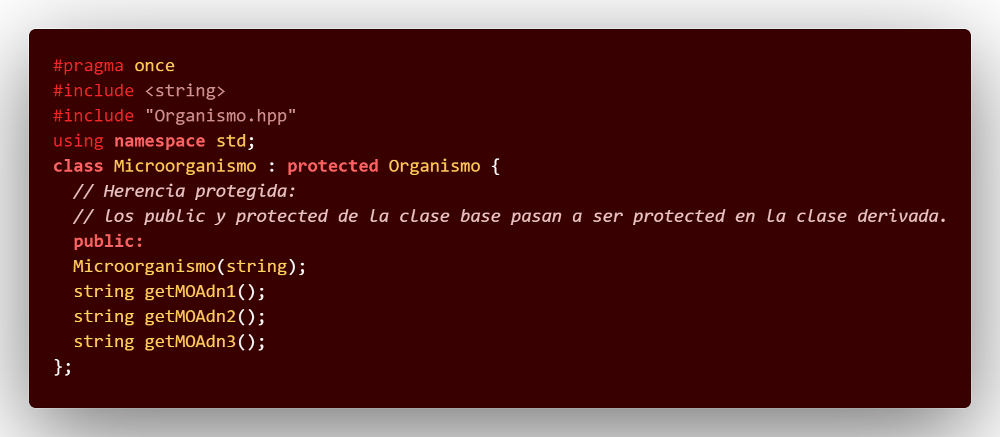

# C++_PDC7

## :copyright: Autor

- :camera:  
- :woman: **Mónica Valeria Castillo**
- :e-mail: monicastillo@unitec.edu
- :link: [github.com/monicastle](https://github.com/monicastle)
- :calendar: 06/09/2020

---

## :dart: Objetivos

Punto de Control #07 en **C++** diseñado para demostrar:

1. :nut_and_bolt: El manejo de:
   - **Herencia**
   - **Polimorfismo**
   - **Templates**
2. :books: La implementación y mejora de:
   - La visibilidad de lo que es la herencia y el polimorfismo
3. :open_file_folder:La organización de:
   - Código (**Visual Studio Code** y Repositorio en **Github**)
   - Imágenes (Extensión **Polacode** de **VSC**)
   - Formato (**Markdown** en **VSC**)

---

## :black_large_square: Ejemplo Herencia

## :yellow_circle: Herencia.cpp

## :yellow_circle: Persona.cpp

## :yellow_circle: Persona.hpp

## :yellow_circle: Alumno.cpp

## :yellow_circle: Alumno.hpp

## :yellow_circle: Maestro.cpp

## :yellow_circle: Maestro.hpp

---
## :black_large_square: Ejemplo Polimorfismo

## :orange_circle: Polimorfismo.cpp

## :orange_circle: Polimorfismo_Persona.cpp

## :orange_circle: Polimorfismo_Persona.hpp

## :orange_circle: Polimorfismo_Alumno.cpp

## :orange_circle: Polimorfismo_Alumno.hpp

## :orange_circle: Polimorfismo_Maestro.cpp

## :orange_circle: Polimorfismo_Maestro.hpp

---

## :black_large_square: Ejemplo Templates

## :red_circle: Templates.cpp

## :red_circle: Pila.hpp

## :red_circle: Cadenas.hpp

## :red_circle: Dobles.cpp

## :red_circle: Enteros.hpp

## :red_circle: MiClase.cpp

## :red_circle: MiClases.hpp

---

## :black_large_square: Ejemplo Visibildad Public | Private | Protected

## :purple_circle: ADN.cpp

## :purple_circle: Humano.cpp

## :purple_circle: Humano.hpp

## :purple_circle: Animal.cpp

## :purple_circle: Animal.hpp

## :purple_circle: Organismo.cpp

## :purple_circle: Organismo.hpp

## :purple_circle: Microorganismo.cpp

## :purple_circle: Microorganismo.hpp

---

## :computer: Código

- :blue_book: [C_PDC7](https://github.com/monicastle/C_PDC7)

---
## :wrench: Herramientas
- :package: [Visual Studio Code](https://code.visualstudio.com/)
- :camera: [Polacode-2020 v0.5.2](https://github.com/jeff-hykin/polacode)
- :notebook: [Markdown Cheatsheet](https://github.com/adam-p/markdown-here/wiki/Markdown-Cheatsheet)
- :smile: [Emoji Cheat Sheet](https://www.webfx.com/tools/emoji-cheat-sheet/)
